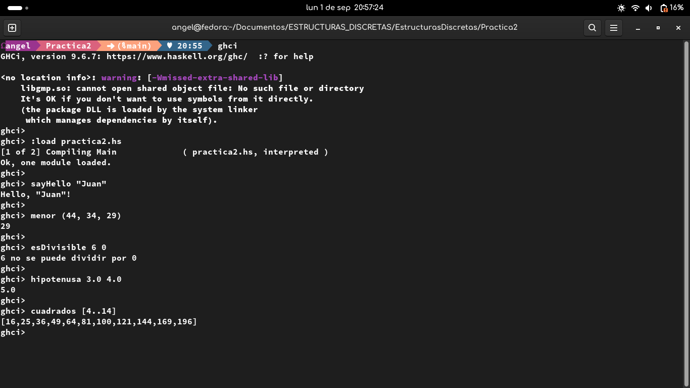

# Información de la Práctica 2

## Objetivo de la práctica

El objetivo de la práctica es que el estudiante aprenda como funciona Haskell, mediante la implementación de funciones básicas como mostrar un mensaje, realizar operaciones matemáticas.

Demostrando su conocimiento de la sintaxis de funciones, tipos de variable, operaciones básicas, funciones como *mod*, *sqrt* y la condicional *If-Then-Else*, las cuales aprendió en las clases de laboratorio.

## Tiempo requerido

Un aproximado de 3 horas dedicadas a la investigación e implementación de funciones.

## Actividad 1

