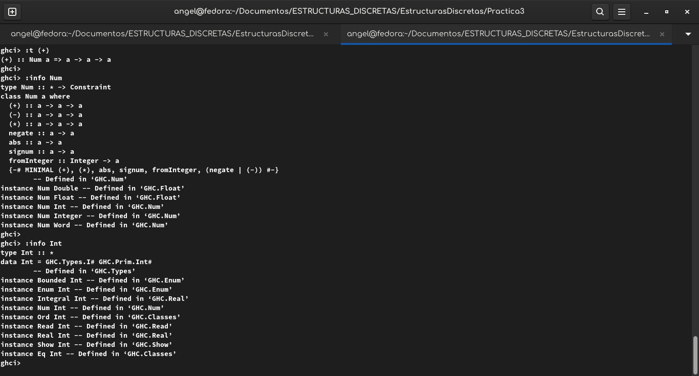

# Información de la Práctica 3

## Objetivo de la Práctica

El objetivo de esta práctica es que el estudiante aprenda sobre las *typeclass* y sepa sobre sus diferencias y su utilidad para la programación en *Haskell*, también aprendió a crear sus propios tipos de datos para generar elementos y funciones, por otro lado, que conozca la sintaxis de una lista por comprensión y que las aplique en funciones dentro de *Haskell*, ademas del uso de otras funciones como *elem*, *sum* y *length*, por ultimo, que haga uso de los commits semánticos para tener repositorios mejor trabajados y presentables.

Todos estos conocimientos, ayudaran al alumno a la introducción de la **Recursión** que es un tema dentro de la programación funcional, este tema lo comenzara a estudiar mas adelante en las siguientes clases de laboratorio y prácticas.

## Tiempo requerido

Un aproximado de 3 horas o más, enfocadas en la implementación de las funciones e investigación para llevar a cabo las actividades de la práctica

## Comentarios

En la función **conjuntoLista** se definió como:

```
conjuntoLista :: (Eq a) => [a] -> [a]
conjuntoLista (x:y) = [x] ++ conjuntoLista [r | r <- y, r /= x ]
```

Haciendo uso de la *typeclass* **Eq** para poder saber si *r es diferente de x*, por recomendación de *ghci* para que la función compilara correctamente para todo los tipos de datos.

## Actividad 1

¿Cuál es la diferencia entre **Num** e **Int**?

**Num** es una *typeclass* de tipos numéricos y sus instancias se pueden comportar como números, ademas contiene operadores como **(+)**, **(-)**, **(*)**, entre otros, esta *typeclass* incluye tanto números reales y enteros, ademas tiene subclases como *Integral* que solo maneja numero enteros y *Floating* que incluye números en coma flotante.

En el caso de **Int**, es un tipo de dato de números enteros, pertenece a la clase *Integral* (subclase de **Num**), y tiene un valor máximo de 2147483647 y el mínimo -2147483648.

Por lo tanto, se podría decir que entre sus diferencias tenemos su tipo, mientras que **Num** es una typeclass, **Int** es un tipo de dato de la clase *Integral*, también son diferentes en la cantidad de elementos que manejan, ya que **Num** maneja todos los números reales y enteros, e **Int** solo maneja números enteros de un cierto rango.



### Bibliografia

Tipos y clases de tipos — ¡Aprende Haskell por el bien de todos! v0 documentation. (s/f). Aprendehaskell.es. Recuperado el 13 de septiembre de 2025, de http://aprendehaskell.es/content/Tipos.html
