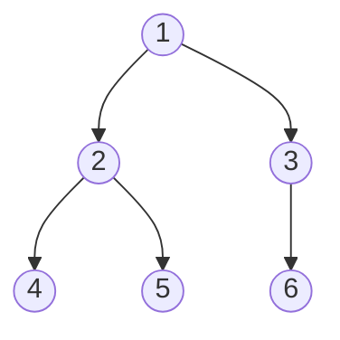
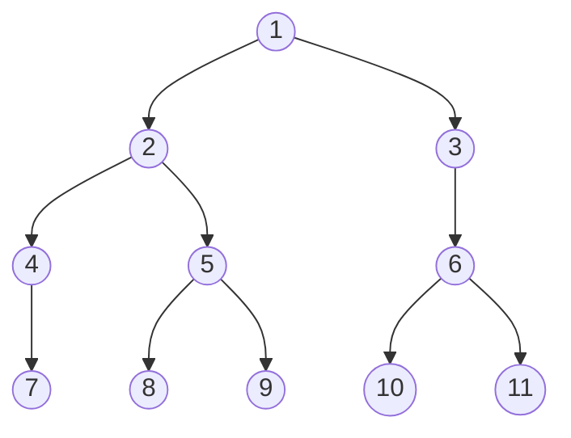
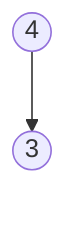
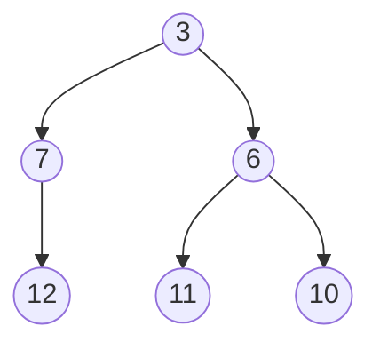

# Información de la Práctica 3

## Objetivo de la Práctica

El objetivo de la práctica es aplicar los conocimientos del estudiante sobre arboles, de manera que implemente funciones en *Haskell* haciendo uso de ellos, de manera que recalque sus conocimientos en la creación de sus propios tipos de datos, y otras características de *Haskell*.

También demostrando los conocimientos adquiridos principalmente en sus clases de teoría y de laboratorio.

## Tiempo requerido

Un aproximado de 4 horas, enfocadas en la implementación de las actividades, resolución de errores y la investigación de información para realizar las actividades de la práctica.

## Actividad Sintaxis

### 1.

Representaciones graficas de dos árboles binarios

### 2.

a) AB 4 (Vacio ) (AB 3 Vacio Vacio )

b) AB 4 Vacio (AB 3 Vacio (AB 5 Vacio Vacio))

c) AB 3 (AB 7 (AB 12 Vacio Vacio) Vacio) (AB 6 (AB 11 Vacio Vacio) (AB 10 Vacio Vacio))

